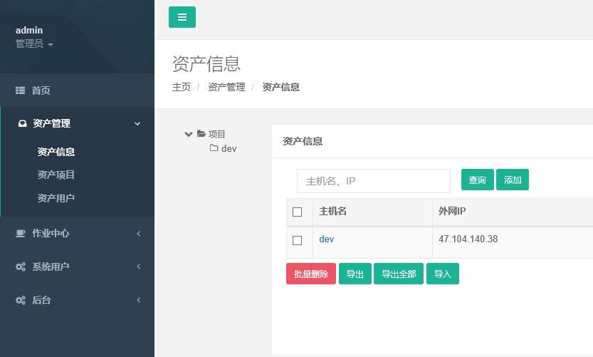
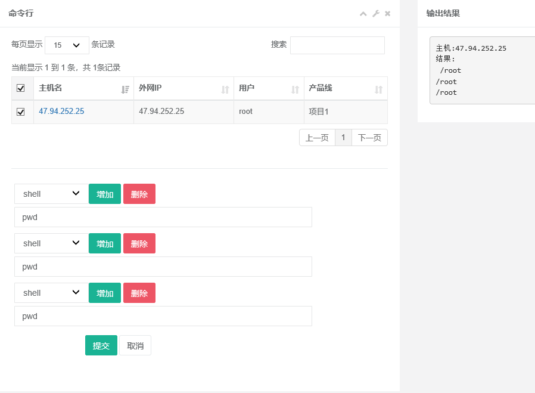
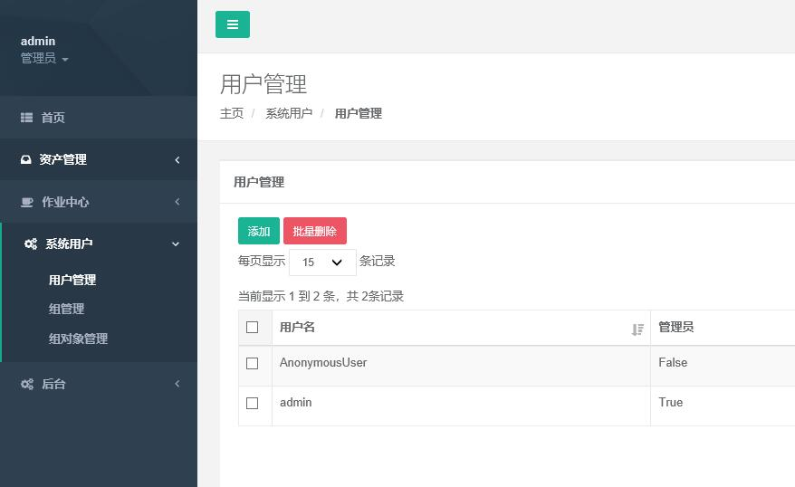
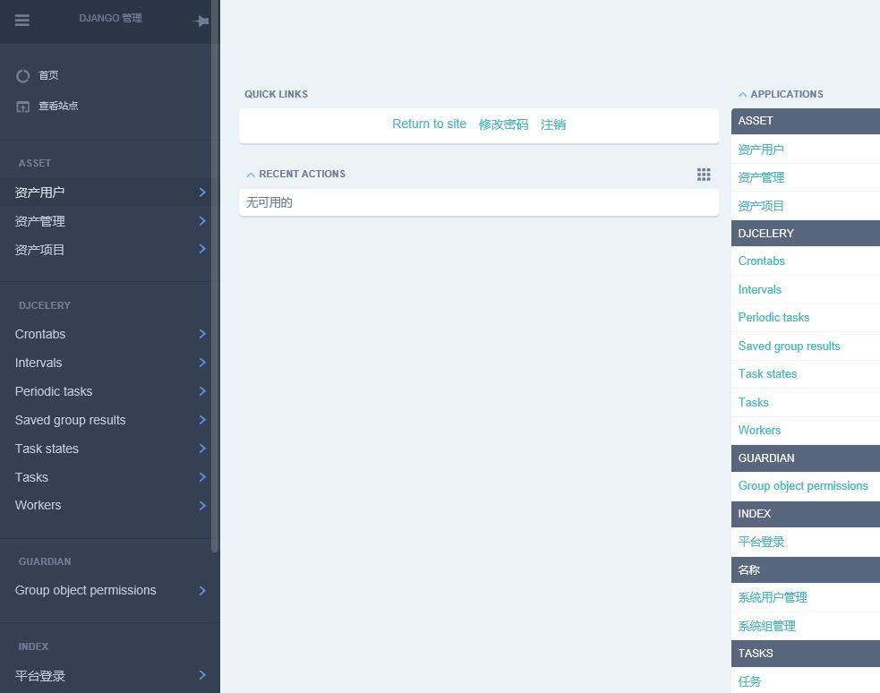
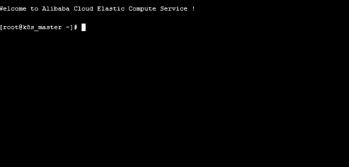

linux 云主机 管理系统,包含 CMDB系统,webssh登录、命令执行、异步执行shell/python/yml、查看日志、定时任务等功能。


### 目录结构

  *  asset     资产
        * api   asset/api/asset.html
  *  chain      主配置目录
  *  crontab    定时任务
  *  data       测试数据/Dockerfile目录
  *  index      首页及用户处理
  *  tasks      任务
  *  name       系统用户 |　组　｜ 权限
  *  static     css | js  
  *  templates  静态模板
  *  webssh     终端ssh登录     参考的  https://github.com/huashengdun/webssh   此项目

###  权限

关于权限,采用的为 django-guardian  对象权限  和 django自带auth权限 相结合


###  环境


前端模板：
  * INSPINIA 2.7.1  

后端：
  * django==2.0.5
  * Python 3.6.5
  
运行环境：
  *   Centos 7.5

数据库：
  * 目前开发阶段 mysql


###  部署


```bash
git clone https://github.com/hequan2017/chain.git
```

修改 chain/settings.py
```bash
web_ssh = "39.104.174.116"    ##修改为本机外网IP
web_port = 8002
```

```bash
mkdir /etc/ansible/
cd chain/

yum  install   sshpass  bzip2  redis   -y
systemctl start redis
pip3   install -r   requirements.txt

cd /tmp/
wget https://files.pythonhosted.org/packages/12/2a/e9e4fb2e6b2f7a75577e0614926819a472934b0b85f205ba5d5d2add54d0/Twisted-18.4.0.tar.bz2
tar xf Twisted-18.4.0.tar.bz2
cd Twisted-18.4.0
python3 setup.py install
```

```bash
cd  chain/
python3     manage.py   makemigrations
python3     manage.py   migrate

python manage.py  shell
from  name.models import Names
user=Names.objects.create_superuser('admin','hequan@chain.com','1qaz.2wsx')
exit()

python3   manage.py runserver 0.0.0.0:80

python3    webssh/main.py    ##启动终端登录功能

python3   manage.py   celery worker     --loglevel=info
python3   manage.py   celery beat --loglevel=INFO

```

```bash
如果遇到报错 ImportError: No module named '_sqlite3' ,可以执行下面的操作

yum -y install sqlite-devel

重新编译python3.6.5

想在windows 环境下运行,请注释 tasks/views.py  以下两行

from   task.ansible_2420.runner import AdHocRunner
from   task.ansible_2420.inventory import BaseInventory

```

### docker部署

可以参考  data/dockerfile-*   文件部署

```bash
/opt
    chain
    password.sh
    dockerfile-chain
    dockerfile-python3
    supervisord.conf


cd /opt
mv  /opt/chain/data/dockerfile-python3   .
mv  /opt/chain/data/dockerfile-chain   .
mv  /opt/chain/data/supervisord.conf  .
mv  /opt/chain/data/password.sh  .


修改password.sh 里面的密码

docker build  -t python3.6.5  -f dockerfile-python3    .
docker build  -t chain   -f dockerfile-chain  --build-arg  ip='39.104.174.116'  .

docker  run  -itd  --name chain   -p 8001:8001  -p 8002:8002    chain

docker  exec  -it   chain /bin/bash
```

###   截图






---

